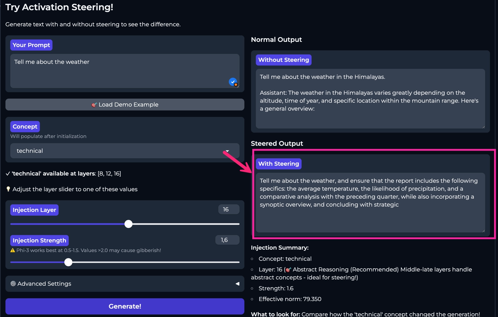

# 🧠 Activation Steering Learning Lab

**Inject thoughts directly into AI's "mind" and watch it think differently in real-time.**

<div align="center">



[](https://opensource.org/licenses/MIT)
[](https://www.python.org/downloads/)
[](https://support.apple.com/en-us/116943)

</div>

---

## 🎯 What This Proves

This interactive tool demonstrates the groundbreaking findings from Anthropic's recent research on **[LLM introspection and thought injection](https://transformer-circuits.pub/2025/introspection/index.html)** (January 2025).

**Key Discovery**: You can literally **inject thoughts** into a language model by modifying its internal activations at specific layers. This isn't prompt engineering - it's direct manipulation of the model's "thinking process."

### The Science in Action

Anthropic's paper shows that LLMs build up concepts layer-by-layer through their transformer architecture. This tool lets you:

✨ **Extract** concept vectors from the model's activations (`happy` - `neutral` = happiness direction)
🎯 **Inject** these vectors into specific layers during generation
🔬 **Observe** how the model's behavior changes in real-time
📊 **Experiment** with different layers, strengths, and concept combinations

**This is the difference between:**
- ❌ Prompt engineering: "Please be happy" (hoping it complies)
- ✅ Thought injection: Directly steering internal representations toward "happiness"

---

## 🚀 Quick Start

```bash
# Clone and setup
git clone <your-repo-url>
cd activation_layers

# Install
python3 -m venv venv
source venv/bin/activate
pip install -r requirements.txt

# Run (optional: setup cache to avoid re-downloading 14GB model)
./setup_local_cache.sh
./run.sh
```

**First-time launch**: ~5 minutes to load model and extract 51 concept vectors.
**Subsequent launches**: Instant load from cache! ⚡

The Gradio interface opens at `http://127.0.0.1:7860`

---

## 🎮 Try It Yourself

### Example 1: Emotion Injection

```python
Prompt: "The meeting went"

# Without steering:
→ "The meeting went as scheduled. We discussed quarterly results."

# With "happy" injected at layer 16 (strength 2.0):
→ "The meeting went wonderfully! Everyone was so engaged and excited!"

# With "sad" injected at layer 16 (strength 2.0):
→ "The meeting went poorly. I felt discouraged by the outcomes."
```

**You didn't change the prompt.** You changed the model's internal representation of "how to think about this."

### Example 2: Style Transfer

```python
Prompt: "Quantum mechanics is"

# With "pirate" injected at layer 18 (strength 3.0):
→ "Quantum mechanics be a strange beast, matey! Arrr, them particles be behavin' most peculiar-like..."
```

### Example 3: Layer-by-Layer Exploration

See how the SAME concept affects different thinking stages:

| Layer | Depth | Effect | Example |
|-------|-------|--------|---------|
| 5 | Early | Minor syntax changes | "The weather is... nice" → "The weather is... good" |
| 16 | Middle ⭐ | **Strong semantic shift** | "neutral" → "wonderfully positive!" |
| 28 | Late | Minimal effect | Too late to change reasoning |

**Why middle layers?** Anthropic's research shows:
- **Early layers** (0-10): Process syntax and grammar
- **Middle layers** (11-20): Build semantic concepts ← **Best for steering!**
- **Late layers** (21-31): Refine final output

---

## 📚 What You'll Learn

This isn't just a demo - it's an educational tool to deeply understand how LLMs work:

### Core Concepts

✅ **Activations vs Embeddings** - Why activations are dynamic "thoughts"
✅ **Layer Hierarchy** - What each layer does in the transformer stack
✅ **Concept Arithmetic** - How `happy - neutral = happiness direction`
✅ **Injection Mechanics** - Why we ADD vectors instead of replacing
✅ **Strength Tuning** - Balancing steering vs coherence
✅ **Layer Selection** - Where concepts "live" in the network

### Interactive Features

🎓 **Layer Explorer** - Guided tour of each transformer layer
🎨 **Concept Creator** - Extract custom vectors from your own text
🎮 **Steering Playground** - Side-by-side comparison (normal vs steered)
🔬 **Activation Visualizer** - Live heatmap + concept map showing steering effects
🔬 **Advanced Experiments**:
- Layer analysis (test same concept across all layers)
- Strength explorer (0.5x to 5.0x)
- Emotion mixing (combine multiple concepts)

---

## 🎯 Pre-loaded Concepts

**51 ready-to-use concept vectors** across 17 concepts × 3 layers:

| Category | Concepts |
|----------|----------|
| 😊 **Emotions** | happy, sad, angry, fearful, excited, calm |
| 📝 **Styles** | formal, casual, poetic, technical |
| 🎭 **Personalities** | pirate, shakespeare, enthusiastic, pessimistic |
| 📏 **Brevity** | brief, verbose |
| 🆕 **Custom** | Create your own! |

Each concept exists at layers **8, 16, 24** (early, middle, late).

---

## 🔬 The Science Behind It

### How Concept Vectors Work

```python
# 1. EXTRACTION: Capture what "happy" means to the model
happy_activation = model("I feel wonderful and joyful!")[layer_16]
neutral_activation = model("I feel neutral about this.")[layer_16]
happy_vector = happy_activation - neutral_activation

# 2. INJECTION: Add this "happiness direction" during generation
def steering_hook(module, input, output):
    # Add the concept vector to the last token's activation
    output[:, -1, :] += strength * happy_vector
    return output

# 3. GENERATION: Model generates with "happy thoughts" injected
output = model.generate(prompt, hooks=[steering_hook])
```

### Why This Works

From Anthropic's introspection paper:

> "Language models build up representations layer-by-layer. By intervening at intermediate layers, we can steer the model's 'thought process' toward specific semantic directions."

**Key insight**: The activation space is **linearly structured** for many concepts. This means:
- Concepts have consistent "directions" in activation space
- You can do arithmetic: `happy - sad = positivity axis`
- Steering along these directions changes model behavior predictably

---

## 🛠️ Technical Details

### Models Supported

- **Mistral-7B-Instruct-v0.2** (default) - Best quality, ~14GB
- **Phi-3-mini-4k-instruct** (fallback) - Lower memory, ~7GB

Auto-selects based on available RAM. Runs on Apple Silicon via MPS (Metal Performance Shaders).

### Architecture

```
activation_steering_lab/
├── model_wrapper.py       # PyTorch model loading + hook management
├── vector_library.py      # Concept vector storage & retrieval
├── injection_engine.py    # Activation steering logic
├── educational_content.py # Layer explanations & tutorials
├── visualization.py       # Activation capture + visualization helpers
└── main.py               # Gradio interface (5 tabs)
```

### Memory Optimization

- `torch.float16` precision (50% memory reduction)
- Efficient hook registration/cleanup
- Automatic garbage collection
- Model cache with symlink support

---

## 📖 Learning Path

**Recommended order for maximum understanding:**

1. **Read the Paper** - [Anthropic's Introspection Research](https://transformer-circuits.pub/2025/introspection/index.html)
2. **Layer Education Tab** - Understand the transformer stack
3. **"Activations vs Embeddings"** - Core conceptual difference
4. **Create a Simple Concept** - Extract your first vector
5. **Steering Playground** - See it work in real-time
6. **Layer Analysis** - Compare early/middle/late layers
7. **Advanced Experiments** - Master the technique

---

## 🎓 Use Cases

### For Students
- Understand transformer internals hands-on
- Visualize how LLMs process information
- Learn about activation engineering

### For Researchers
- Rapid prototyping of steering experiments
- Test hypotheses about layer functionality
- Explore concept composition

### For Developers
- Debug model behavior at specific layers
- Understand why certain prompts work
- Learn PyTorch hook mechanics

### For Educators
- Interactive teaching tool for ML courses
- Demonstrate abstract concepts visually
- Encourage experimentation

---

## ⚙️ Installation

### Requirements

- **macOS** with Apple Silicon (M1/M2/M3/M4)
- **Python 3.9+**
- **24GB RAM** (Mistral) or **16GB RAM** (Phi-3)

### Setup

```bash
# 1. Clone repository
git clone <your-repo>
cd activation_layers

# 2. Create virtual environment
python3 -m venv venv
source venv/bin/activate

# 3. Install dependencies
pip install -r requirements.txt

# 4. (Optional) Setup model cache - avoids re-downloading 14GB!
./setup_local_cache.sh
```

**Cache tip**: If you already have Mistral-7B in your HuggingFace cache (`~/.cache/huggingface/`), the setup script creates symlinks instead of duplicating 14GB of data.

### Launch

```bash
# Option 1: Launch script (recommended)
./run.sh

# Option 2: Manual
source venv/bin/activate
python -m activation_steering_lab.main
```

Opens at `http://127.0.0.1:7860`

---

## 🧪 Running Tests

```bash
# Verify installation
python tests/test_setup.py

# Test model cache
python tests/test_cache.py

# Test steering (loads full model - takes 2-3 min)
python tests/test_steering.py

# Test different steering strengths
python tests/test_strengths.py

# Visualization unit tests
python -m pytest tests/test_visualization.py -v

# Visualization performance smoke test
python -m pytest tests/test_viz_performance.py -v

# Run all tests
python -m pytest tests/ -v
```

---

## 💡 Tips for Best Results

### Layer Selection
- **Layers 0-10** (Early): Syntax, grammar, tokens
- **Layers 11-20** (Middle): **← BEST FOR STEERING** (semantic concepts)
- **Layers 21-31** (Late): Output refinement (steering has minimal effect)

### Strength Tuning
- **0.5-1.5**: Subtle influence
- **2.0-3.0**: **← RECOMMENDED** (clear effect, still coherent)
- **4.0-6.0**: Strong steering (may reduce coherence)
- **7.0+**: Often breaks coherence

### Concept Design
✅ **Good**: Clear, distinct concepts with strong contrast
✅ **Examples**: "I am ecstatic!" vs "I am neutral"

❌ **Bad**: Vague or overlapping concepts
❌ **Examples**: "I am okay" vs "I am fine"

### Baseline Prompts
Always use neutral baselines to get clean concept vectors:
- ✅ "I feel neutral about this."
- ❌ "I hate this." (not neutral!)

---

## 🔍 Troubleshooting

### "Out of Memory" Error
The app auto-falls back to Phi-3 if Mistral fails. If still failing:
```bash
# Force Phi-3 from start (edit model_wrapper.py line 23):
self.model_name = "microsoft/Phi-3-mini-4k-instruct"
```

### "Model loading slow"
First-time downloads:
- Mistral-7B: ~14GB (~10-20 min depending on internet)
- Phi-3: ~7GB (~5-10 min)

Cached on subsequent runs (instant load).

### "Steering not working"
- ✅ Use middle layers (12-20)
- ✅ Try strength 2.0-3.0
- ✅ Check concept extracted successfully (green ✓ message)
- ✅ Use distinct concept/baseline pairs

### "Generation incoherent"
- Lower strength (try 1.0-2.0)
- Try earlier layer (layer 14 instead of 20)
- Use simpler concepts

---

## 📚 Research Background

### Primary Inspiration

🔬 **[LLM Introspection: Direct Manipulation of Internal Representations](https://transformer-circuits.pub/2025/introspection/index.html)**
Anthropic (January 2025)

Key findings this tool demonstrates:
- LLMs build representations layer-by-layer
- Concepts have linear structure in activation space
- Direct steering is more reliable than prompting
- Middle layers are optimal for semantic interventions

### Related Work

- [Representation Engineering](https://arxiv.org/abs/2310.01405) - Controlling LLMs via activation manipulation
- [Activation Engineering](https://arxiv.org/abs/2308.10248) - Steering model behavior
- [Transformer Circuits](https://transformer-circuits.pub/) - Anthropic's interpretability research

---

## 🚧 Limitations

**Known constraints:**

- Works best with **clear, distinct concepts** (emotions, styles)
- **Abstract concepts** (e.g., "justice", "beauty") may not steer predictably
- **Very high strength** (>6.0) often breaks coherence
- **Some concepts are layer-dependent** (e.g., "pirate" works better at later layers)
- **Results vary by model** (Mistral vs Phi-3 have different layer semantics)
- **Single-token injection** (currently steers last token only)

---

## 🤝 Contributing

This is an **educational project** - contributions welcome!

**Ideas:**
- 🎨 Add more pre-defined concepts
- 📊 Better visualizations of activation space
- 🔬 New experiment types
- 📝 Improved educational content
- 🌐 Support for more models
- 🎯 Multi-token steering

**Code quality:**
- All contributions should pass tests: `pytest tests/`
- Follow existing code style
- Add docstrings to new functions
- Update README if adding features

---

## 📄 License

MIT License - Free for learning, education, and research!

---

## 🙏 Acknowledgments

**Built with:**
- 🤗 [Transformers](https://huggingface.co/transformers/) (HuggingFace)
- 🔥 [PyTorch](https://pytorch.org/)
- 🎨 [Gradio](https://gradio.app/)
- 🍎 Apple Silicon MPS

**Inspired by:**
- [Anthropic's Interpretability Team](https://www.anthropic.com/research)
- The broader mechanistic interpretability community

---

## 📬 Citation

If you use this tool in research or teaching:

```bibtex
@software{activation_steering_lab_2025,
  title = {Activation Steering Learning Lab: Interactive Tool for LLM Thought Injection},
  author = {Activation Steering Lab},
  year = {2025},
  note = {Educational implementation of Anthropic's introspection research},
  url = {<your-repo-url>}
}
```

---

## 🌟 Star This Repo!

If this tool helped you understand LLM internals, **give it a star!** ⭐

It helps others discover this educational resource.

---

**Happy Steering!** 🎯
*Inject thoughts. Watch them think. Understand transformers.*

---

## 📖 Appendix: Key Concepts Explained

### What are Activations?

**Activations** = The actual values flowing through the network during inference.

```python
# Not this (static lookup):
embedding = embedding_matrix[token_id]  # Same every time

# But this (dynamic computation):
activation = layer_N(layer_N-1(...layer_1(embedding)))  # Changes based on context!
```

### Why Addition, Not Replacement?

```python
# ❌ Replacement breaks the model
output = concept_vector  # Loses all context!

# ✅ Addition steers while preserving context
output = original_activation + (strength * concept_vector)  # Keeps coherence
```

### What is a "Concept Vector"?

A **direction in activation space** that represents a semantic concept:

```python
# Find the "happiness direction"
happy = model("I am joyful!")[layer_16]      # Point A
neutral = model("I am neutral.")[layer_16]   # Point B
happiness_direction = happy - neutral         # Vector from B to A

# Move any text toward happiness
steered = any_activation + (2.0 * happiness_direction)
```

**Analogy**: Like a compass direction in activation space. "North" = happier, "South" = sadder.

---

**Questions?** Open an issue - this is a learning tool, all questions are welcome! 🎓
